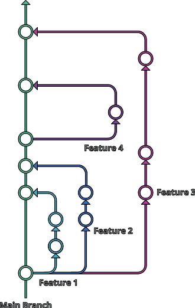
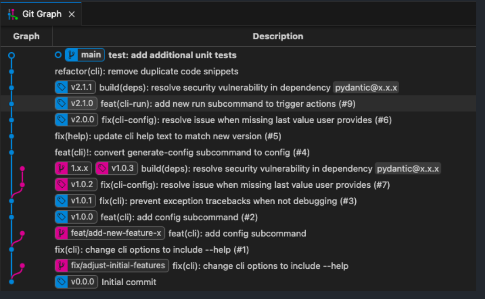

# Release strategy (implementation) 2

## Overview

Unfortunately many of these rules can only be applied at the repo level as a Github enterorise subscription is required to do it at the org level. Thus, it is of interest to make cookie cutter projects with all these setting enabled.

## Squash merge
1. Feature branches should be cut from main
2. The PR should be merged as a squash commit.

## Github settings
1. Disallow merge commits & squash commits (repo settings)
2. Set squash merge to take PR title & description
2. protect master and release branches
    - Require PR with approval

## Branching strategy

Use Github Flow with feature-branching strategy and squash commits.

1. [PSR Discussion](https://github.com/python-semantic-release/python-semantic-release/issues/816)
2. [githubflow.github.io](https://githubflow.github.io/)
3. [git-branch-strategy](https://www.gitkraken.com/learn/git/best-practices/git-branch-strategy)

## PSR & Tagging

See [PSR Discussion](https://github.com/python-semantic-release/python-semantic-release/issues/816)

Image from above discussion:
